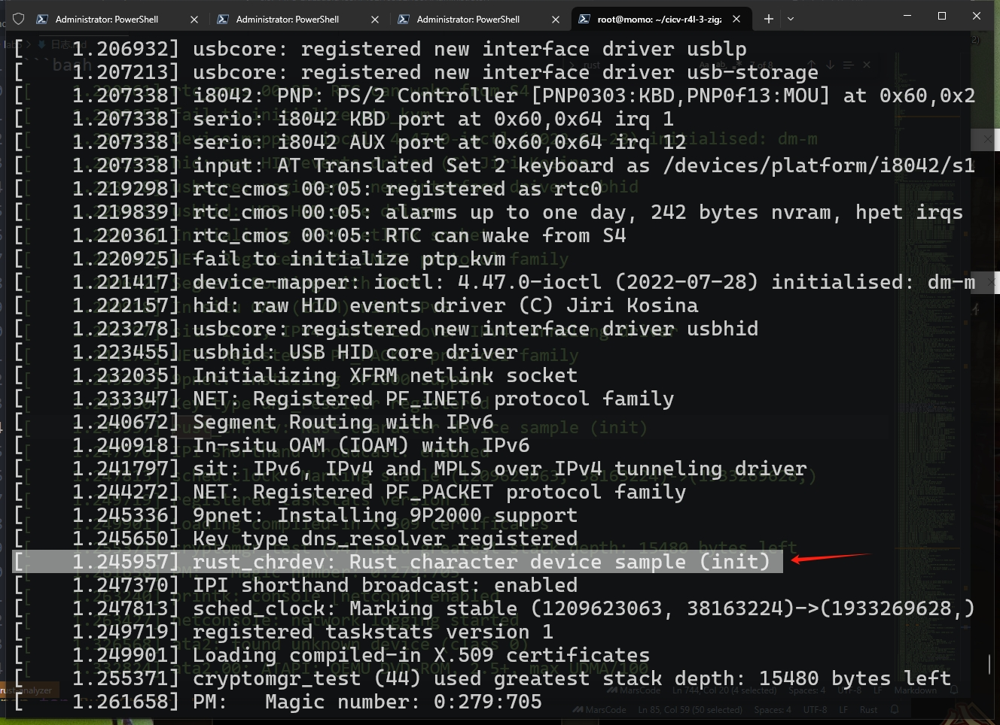
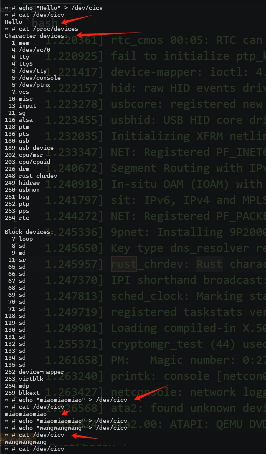

# 实验记录

字符设备 的文件截图和其他过程截图

1. 设备初始化

2. 写入和读出设备数据


```rust
// 读和写的代码
    fn write(
        this: &Self,
        _file: &file::File,
        reader: &mut impl kernel::io_buffer::IoBufferReader,
        offset: u64,
    ) -> Result<usize> {
        pr_info!("Rust character device sample (write)\n");
        pr_err!("write debug message: Error message (level 3) without args\n");
        let mut buf = this.inner.lock();

        let offset = offset as usize;

        if offset > GLOBALMEM_SIZE {
            return Ok(0);
        }

        let count = core::cmp::min(GLOBALMEM_SIZE - offset, reader.len());
        reader.read_slice(&mut buf[offset..offset + count])?;
        Ok(count)
    }

    fn read(
        this: &Self,
        _file: &file::File,
        writer: &mut impl kernel::io_buffer::IoBufferWriter,
        offset: u64,
    ) -> Result<usize> {
        pr_info!("Rust character device sample (read)\n");
        pr_err!("read debug message: Error message (level 3) without args\n");
        let buf = this.inner.lock();

        let offset = offset as usize;

        if offset > GLOBALMEM_SIZE {
            return Ok(0);
        }

        let count = core::cmp::min(GLOBALMEM_SIZE - offset, writer.len());
        writer.write_slice(&buf[offset..offset + count])?;
        Ok(count)
        // Err(EPERM)
    }
```

Q：作业5中的字符设备/dev/cicv是怎么创建的？它的设备号是多少？它是如何与我们写的字符设备驱动关联上的？
1. 
src_e1000/build_image.sh 文件里的代码创建的
```bash
echo "mknod /dev/cicv c 248 0" >> etc/init.d/rcS
```
2. 
设备号是248
3. 
文档 https://www.kernel.org/doc/Documentation/admin-guide/devices.txt
```
问:翻译 234-254 char RESERVED FOR DYNAMIC ASSIGNMENT
Character devices that request a dynamic allocation of major number will
take numbers starting from 254 and downward.

claude答:翻译如下:

234-254 字符设备 预留用于动态分配

请求动态分配主设备号的字符设备将从254开始向下使用设备号。

即字符设备由234-253的主设备号预留,供系统动态分配给需要的字符设备。请求动态分配主设备号的字符设备,将从254开始依次分配设备号,如254、253等。
```
249后都分配出去了,我们的字符设备刚好分配到248
然后创建的设备也是248,这就管上了

# 遇到的问题
1. 设备文件常用的命令
```bash
ls –l sd* ttyS* #可以显示设备类型及设备号；
cat /proc/devices #显示已加载的驱动及关联的设备号
# mknod命令用来创建设备文件
mknod /dev/mycdev c 42 0
mknod /dev/mybdev b 240 0
```
2. 误解文档"这一次，我们回到Linux内核中，添加一个samples/rust/rust_chrdev.rs文件。
"
以为要自己写,其实已经提供了.
3. rust-analyzer 3分钟崩溃5次,不再重启
发现是中文翻译插件的问题,删除就好了.
4. rust-analyzer读取不到子文件夹的项目,如何解决
在根目录的 .vscode 文件夹中创建或编辑 settings.json 文件，以配置 Rust Analyzer 使用 rust-project.json 文件。
```问chatgpt
/root/cicv-r4l-3-zigzagpig/linux/  下没有Cargo.toml ,但是有rust-project.json,该怎么办
```
```json
{
    "rust-analyzer.linkedProjects": [
        "/root/cicv-r4l-3-zigzagpig/linux/rust-project.json"
    ],
    "rust-analyzer.checkOnSave.command": "clippy",
    "rust-analyzer.procMacro.enable": true,
    "rust-analyzer.cargo.allFeatures": true,
    "rust-analyzer.cargo.loadOutDirsFromCheck": true
}
```
5. 如何查看安装了哪些rust版本,如何切换
```bash
# 使用rustup命令查看已安装的Rust版本:
rustup show
# 使用rustup命令切换默认版本:
rustup default 1.62.0
# 切换版本后,可能需要配置环境变量让其他工具识别正确版本(如Cargo)
source $HOME/.cargo/env
```
6. 一个rust-analyzer提示,花费了非常长的时间仍然没解决,下次要学会跳过
```bash
Failed spawning proc-macro server for workspace `/root/cicv-r4l-3-zigzagpig/linux/rust-project.json`: no sysroot
```
7.详细解释脚本src_e1000/build_image.sh
这段脚本是用来构建并运行一个虚拟机的根文件系统，并通过QEMU启动一个虚拟机。以下是对每一部分的详细解释：

```sh
#!/bin/sh
```
- 指定该脚本使用`/bin/sh`解释器来执行。

```sh
busybox_folder="../busybox-1.36.1"
kernel_image="../linux/arch/x86/boot/bzImage"
work_dir=$PWD
rootfs="rootfs"
rootfs_img=$PWD"/rootfs_img"
```
- 定义了几个变量：
  - `busybox_folder`：指向BusyBox文件夹的路径。
  - `kernel_image`：指向内核镜像文件的路径。
  - `work_dir`：当前工作目录。
  - `rootfs`：根文件系统目录名。
  - `rootfs_img`：根文件系统镜像文件路径。

```sh
make LLVM=1
echo $base_path
```
- 使用`make LLVM=1`命令编译项目，可能是利用LLVM编译工具链。
- 打印`$base_path`变量的值，但脚本中没有定义该变量，因此这行代码可能没有实际作用。

```sh
if [ ! -d $rootfs ]; then
    mkdir $rootfs
fi
```
- 检查`$rootfs`目录是否存在，如果不存在则创建该目录。

```sh
cp $busybox_folder/_install/*  $rootfs/ -rf
cp $work_dir/r4l_e1000_demo.ko $work_dir/$rootfs/
```
- 将BusyBox安装目录中的所有文件复制到`$rootfs`目录中。
- 将当前工作目录中的`r4l_e1000_demo.ko`文件复制到`$rootfs`目录中。

```sh
cd $rootfs
if [ ! -d proc ] && [ ! -d sys ] && [ ! -d dev ] && [ ! -d etc/init.d ]; then
    mkdir proc sys dev etc etc/init.d
fi
```
- 切换到`$rootfs`目录。
- 检查并创建`proc`、`sys`、`dev`和`etc/init.d`目录，如果这些目录不存在的话。

```sh
if [ -f etc/init.d/rcS ]; then
    rm etc/init.d/rcS
fi
echo "#!/bin/sh" > etc/init.d/rcS
echo "mount -t proc none /proc" >> etc/init.d/rcS
echo "mount -t sysfs none /sys" >> etc/init.d/rcS
echo "/sbin/mdev -s" >> etc/init.d/rcS
echo "mknod /dev/cicv c 248 0" >> etc/init.d/rcS
chmod +x etc/init.d/rcS
```
- 检查并删除`etc/init.d/rcS`文件（如果存在）。
- 创建一个新的`rcS`脚本，用于系统启动时执行：
  - 挂载`proc`文件系统。
  - 挂载`sysfs`文件系统。
  - 使用`mdev`来管理设备节点。
  - 创建一个名为`/dev/cicv`的字符设备节点。
- 赋予`rcS`脚本执行权限。

```sh
if [ -f $rootfs_img ]; then
    rm $rootfs_img
fi
```
- 如果`$rootfs_img`文件存在，则删除它。

```sh
cd $work_dir

cd $rootfs 
find . | cpio -o --format=newc > $rootfs_img
```
- 切换到工作目录。
- 切换到`$rootfs`目录。
- 使用`find`命令查找当前目录下的所有文件，并使用`cpio`命令将它们打包成一个新的c格式的归档文件，并保存为`$rootfs_img`。

```sh
cd $work_dir

qemu-system-x86_64 \
-netdev "user,id=eth0" \
-device "e1000,netdev=eth0" \
-object "filter-dump,id=eth0,netdev=eth0,file=dump.dat" \
-kernel $kernel_image \
-append "root=/dev/ram rdinit=sbin/init ip=10.0.2.15::10.0.2.1:255.255.255.0 console=ttyS0 no_timer_check" \
-nographic \
-initrd $rootfs_img
```
- 切换到工作目录。
- 使用`qemu-system-x86_64`命令启动一个QEMU虚拟机，参数解释如下：
  - `-netdev "user,id=eth0"`：使用用户模式网络设备，ID为`eth0`。
  - `-device "e1000,netdev=eth0"`：使用`e1000`网络设备，连接到`eth0`。
  - `-object "filter-dump,id=eth0,netdev=eth0,file=dump.dat"`：创建一个数据包过滤器，将网络流量转储到`dump.dat`文件中。
  - `-kernel $kernel_image`：指定内核镜像文件。
  - `-append "root=/dev/ram rdinit=sbin/init ip=10.0.2.15::10.0.2.1:255.255.255.0 console=ttyS0 no_timer_check"`：传递给内核的命令行参数，包括根文件系统位置、网络配置和控制台设置。
  - `-nographic`：不使用图形界面，所有输入输出通过控制台。
  - `-initrd $rootfs_img`：指定初始内存盘镜像文件。

总结：
这段脚本的主要功能是构建一个包含BusyBox和其他必要文件的根文件系统，并使用QEMU启动一个虚拟机，该虚拟机使用指定的内核和根文件系统镜像。
8. `>` 和 `>>`是什么意思
`>`输出重定向,覆盖写入,`>>`输出重定向,追加写入
9. 这题也卡了一天多
该用ai就用ai,信息不足的情况下怎么想都是白瞎.
还有文档也很重要,想来想去不如看PPT几秒.
这不是数学题和算法题,想有什么用,调用别人的接口就要听别人的话,按照别人的方式来.
10. rust-analyzer 一直在转
这是因为两个窗口的rust-analyzer同时运行,冲突了,关一个
11. 编译命令,方便复制
```bash
make LLVM=1 -j $(nproc)
```
12. rust_chrdev是在哪里定义的?
```rust
module! {
    type: RustChrdev,
    name: "rust_chrdev",
    author: "Rust for Linux Contributors",
    description: "Rust character device sample",
    license: "GPL",
}
```
13. 未解决问题
```bash
  LD      vmlinux.o
vmlinux.o: warning: objtool: 
这两行之间卡非常久是什么情况,如何解决

gpt:
禁用 RETPOLINE：
如果你不需要 RETPOLINE 防护，可以尝试禁用它。你可以通过在编译选项中添加 RETPOLINE=n 来实现：

bash:
make LLVM=1 -j $(nproc) RETPOLINE=n
```
然而我试了仍然需要很久,RETPOLINE仍然出来提示